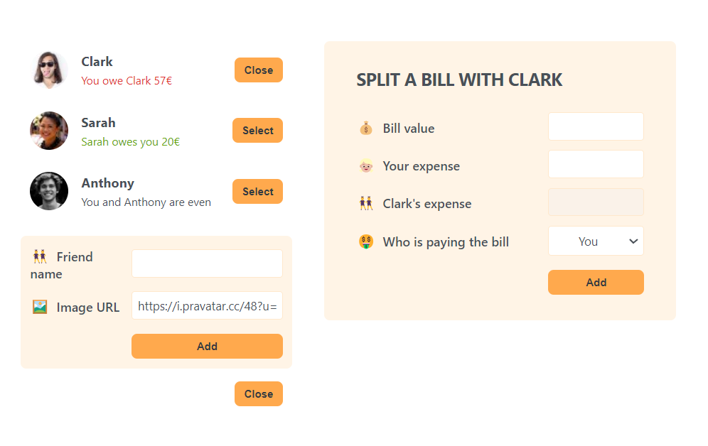

# Eat-'N-Split app

This is a simple React-based application designed to help you keep track of how much you or your friends owe each other after eating out. This app was built as part of a Udemy course 'The Ultimate React Course 2024: React, Next.js, Redux & More'
to practice React concepts.

## Features

- **Add a Friend**: Easily add a new friend to your list with their name and profile image.
- **Add Bill Information**: Enter the total bill amount and specify how much you and your friend(s) paid.
- **Track Balances**: The app shows how much your friends owe you or how much you owe them, calculated based on the entered bill information.

## Demo

